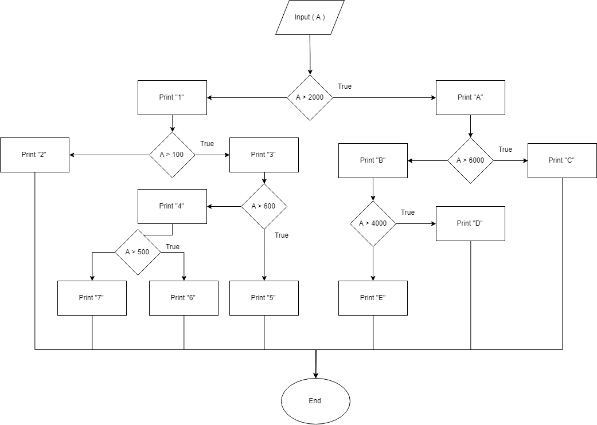

# Flowcharts

1. Create a method which accepts 3 parameters, 2 integers and a boolean.

	* If the boolean is true, the method will return a sum of the two numbers, and it if is false it will return the multiplication of the two numbers.

	For example:

	```
	Input (1, 2, true) -> 3
	Input (3, 3, false) -> 9
	Input (1, 1, true) -> 2
	```

```java
public int acceptMethod(int num1, int  num2, boolean bool) {
	if (bool = true) {
		return num1+num2;
	} else {
		return num1*num2;
	}
}
```

2. Recreate the following flowchart as a project. Ensure that your logic and outputs match that of the flowchart.



```java
public void inputA(int A) {
	if (A > 2000) {
		System.out.println("A");
		if (A > 6000) {
			System.out.println("C");
		} else {
			System.out.println("B");
			if (A > 4000) {
				System.out.println("D");
			} else {
				System.out.println("E");
			}
		}
	} else {
		System.out.println("1");
		if (A > 100) {
			System.out.println("3");
			if (A > 600) {
				System.out.println("5");
			} else {
				System.out.println("4");
				if (A > 500) {
					System.out.println("6");
				} else {
					System.out.println("7");
				}
			}
		} else {
			System.out.println("2");
		}
	}
	
}
```

3. Create a method that takes a single integer A as a parameter.

4. First evaluate if A is greater than 2000. If true, print "1", if false, print "A"

5. Next, Directly under print 1 but not outside of the if statement, make another if statement that elaluates if A is greater that 100. If true, print "2", if false, print "3"

6. And so on. Be sure to check you are nesting the new if statements in the correct place.

```java
public class Runner {

	public static void main(String[] args) {
		Methods A = new Methods();
		A.inputA(2000);
	}

}
```

```java
public class Methods {
	
	public int acceptMethod(int num1, int  num2, boolean bool) {
		if (bool = true) {
			return num1+num2;
		} else {
			return num1*num2;
		}
	}
	
	public void inputA(int A) {
		
		if (A > 2000) {
			System.out.println("A");
			if (A > 6000) {
				System.out.println("C");
			} else {
				System.out.println("B");
				if (A > 4000) {
					System.out.println("D");
				} else {
					System.out.println("E");
				}
			}
		} else {
			System.out.println("1");
			if (A > 100) {
				System.out.println("3");
				if (A > 600) {
					System.out.println("5");
				} else {
					System.out.println("4");
					if (A > 500) {
						System.out.println("6");
					} else {
						System.out.println("7");
					}
				}
			} else {
				System.out.println("2");
			}
		}
		
	}
	
}
```